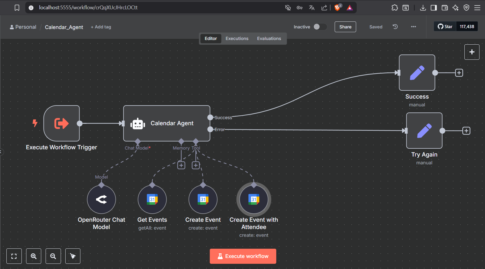

# 🧠 Personal Assistant Agents Suite

This repository contains a suite of **AI-powered agents** built using **n8n** and **LangChain** for workflow automation. It was developed as part of my **Workflow Automation Using n8n and AI Agents Internship**.

The primary goal of this project was to **design and implement a complex workflow** that integrates multiple AI agents, enabling them to collaborate and automate real-world tasks like email management, calendar scheduling, project tracking, and information retrieval.

---

## 🎯 Project Overview

As part of my internship, I was tasked with building a **complex, multi-agent workflow** to demonstrate:

* Natural language understanding for dynamic user commands.
* Orchestration of multiple tools and APIs within n8n.
* Error handling and graceful fallback mechanisms.

This project leverages **n8n**, **LangChain**, **OpenAI GPT models**, and several external APIs to deliver a fully functional **Personal Assistant** system.

---

## 📑 Table of Contents

1. [Installation](#installation)
2. [Configuration](#configuration)
3. [Agents Overview](#agents-overview)
4. [Usage](#usage)
5. [Features](#features)
6. [Learning Outcomes](#learning-outcomes)
7. [Dependencies](#dependencies)
8. [Internship Context](#internship-context)
9. [Troubleshooting](#troubleshooting)
10. [License](#license)

---

## 📥 Installation

1. Clone this repository.
2. Install **n8n** locally or on a server.
3. Import the workflow JSON files into n8n:

   * `Calendar_Agent.json`
   * `Email_Agent.json`
   * `Personal_Assistant.json`
   * `Projects_Agent.json`
   * `Research_Agent.json`
4. Set up API credentials as described in [Configuration](#configuration).

---

## ⚙️ Configuration

* **Google APIs**: OAuth2 credentials for Google Calendar, Gmail, and Google Sheets.
* **OpenAI API**: Access to GPT-4o or GPT-3.5 models.
* **SerpAPI**: For Google search queries.
* **Telegram API**: To interact with the Personal Assistant via Telegram.

Configure credentials within n8n’s credentials manager.

---

## 🤖 Agents Overview

### 📅 Calendar Agent

Manages Google Calendar events:

* Create events (with or without attendees).
* Fetch and summarize events.

**📸 Workflow Screenshot:**

---

### 📧 Email Agent

Handles Gmail actions:

* Send emails (signed as *Nate*).
* Retrieve recent emails or filter by sender.

**📸 Workflow Screenshot:**

---

### 🧑‍💼 Personal Assistant

The central orchestrator:

* Routes queries to Calendar, Email, Projects, and Research agents.
* Interacts with users via Telegram.
* Determines which agent to use based on user input.

**📸 Workflow Screenshot:**

---

### 📂 Projects Agent

Manages project data stored in Google Sheets:

* Retrieve and update project details.

**📸 Workflow Screenshot:**

---

### 🔍 Research Agent

Finds information using:

* Wikipedia.
* Hacker News API.
* SerpAPI (fallback).

**📸 Workflow Screenshot:**

---

## 💻 Usage

* Start the workflows in n8n.
* Use natural language commands via Telegram or HTTP requests.
* Example commands:

  * “Schedule a call with Alex tomorrow at 10 AM.”
  * “Send an email to Sarah: Subject ‘Project Update’.”
  * “What’s the status of Project Apollo?”

---

## ✨ Features

✅ Multi-agent orchestration using LangChain.
✅ Natural language understanding for dynamic workflows.
✅ Google Workspace integration.
✅ Modular and scalable architecture.
✅ Handles errors with retry and fallback mechanisms.

---

## 🎓 Learning Outcomes

During the internship and while working on this project, I gained:

* **Hands-on experience with n8n** for building complex workflows.
* **Understanding of AI agent orchestration** using LangChain.
* Skills in integrating multiple APIs (Google Calendar, Gmail, Sheets, Telegram, SerpAPI).
* Knowledge of **error handling** in workflow automation.
* Best practices for **modular workflow design** and scalability.
* Experience in documenting and presenting technical projects.

---

## 📚 Internship Context

This project is part of my internship titled:

**“Workflow Automation Using n8n and AI Agents”**

It demonstrates my ability to design and implement a **complex AI workflow** capable of handling multiple real-world automation tasks.

---

## 🛠 Troubleshooting

* Verify API credentials are active and authorized in n8n.
* Check workflow logs in n8n for errors.
* Ensure external APIs (Google, OpenAI) are not exceeding rate limits.

---

## 📄 License

This project is for educational and internship purposes.

